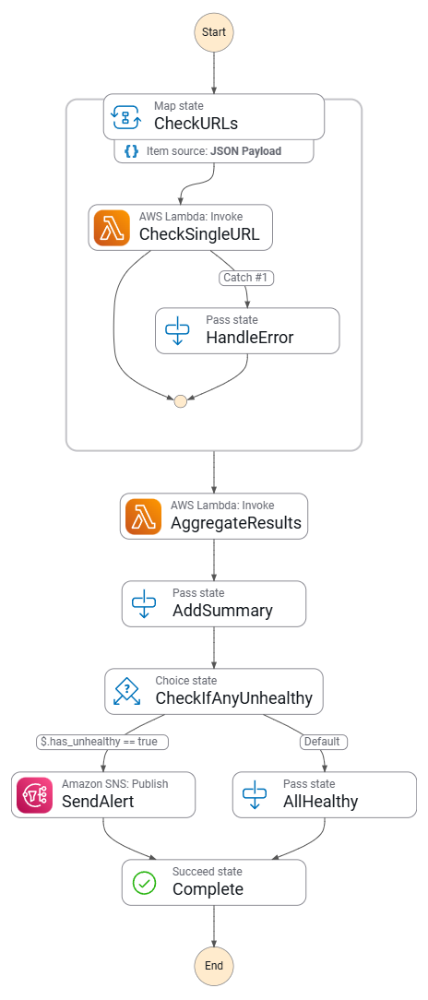

# URL Health Checker with AWS Step Functions

A serverless application that checks the health of multiple URLs in parallel using AWS Step Functions and Lambda. Perfect for monitoring website availability and API endpoints.

## Features

- Parallel Processing: Check up to 5 URLs simultaneously
- Error Handling: Automatic retries with exponential backoff
- Alerting: Email notifications when URLs are down
- Detailed Metrics: Response time, status codes, timestamps
- Serverless: No servers to manage, pay only for what you use

## Architecture


## Project Structure

```
url-health-checker/
├── src/
│   ├── check_url.py              # Lambda: Checks individual URL health
│   └── check_health_status.py    # Lambda: Aggregates health results
├── statemachine/
│   └── state-machine.json         # Step Functions workflow definition
├── template.yaml                  # SAM infrastructure template
├── sample-input.json              # Example input for testing
├── samconfig.toml                 # SAM deployment configuration
├── .gitignore                     # Git ignore patterns
└── README.md                      # This file
```

## Component Overview

### Lambda Functions

**`src/check_url.py`** - URL Health Checker
- Makes HTTP/HTTPS requests to individual URLs
- Measures response time in milliseconds
- Returns structured health status (healthy/unhealthy)
- Handles HTTP errors, timeouts, and network failures
- Configurable timeout per URL (default: 10 seconds)

**`src/check_health_status.py`** - Health Status Aggregator
- Receives array of health check results from Map state
- Determines if any URLs are unhealthy
- Returns boolean flag for conditional alerting
- Used by Step Functions Choice state

### Step Functions State Machine

**`statemachine/state-machine.json`** - Workflow Definition

The state machine orchestrates the entire health checking process:

1. **CheckURLs (Map State)**
   - Runs URL checks in parallel (max 5 concurrent)
   - Invokes `check_url` Lambda for each URL
   - Includes retry logic with exponential backoff
   - Catches and handles Lambda errors gracefully

2. **AggregateResults (Task State)**
   - Invokes `check_health_status` Lambda
   - Determines if any URLs failed
   - Passes results to next state

3. **AddSummary (Pass State)**
   - Adds metadata (execution ID, timestamp)
   - Calculates total URLs checked
   - Prepares data for conditional logic

4. **CheckIfAnyUnhealthy (Choice State)**
   - Branches based on health status
   - Routes to alert if unhealthy URLs found
   - Routes to success if all healthy

5. **SendAlert (Task State)**
   - Publishes message to SNS topic
   - Sends email with execution details
   - Includes list of failed URLs

6. **AllHealthy / Complete (Success States)**
   - Terminal states for workflow completion


### Infrastructure

**`template.yaml`** - SAM Template

Defines all AWS resources:

- **Lambda Functions**: Both health checker and aggregator
- **Step Functions State Machine**: Workflow orchestration
- **SNS Topic**: Email notifications with subscription
- **IAM Roles**: Least privilege permissions for Step Functions
- **CloudWatch Logs**: Execution logging (7-day retention)
- **Parameters**: Configurable notification email
- **Outputs**: Resource ARNs and execution commands

**Key Configurations:**
- Python 3.12 runtime for both Lambdas
- DefinitionSubstitutions for ARN injection
- DependsOn for proper resource ordering
- Parameterized email for flexibility

## Prerequisites

- AWS Account
- AWS CLI configured with credentials
- AWS SAM CLI installed ([installation guide](https://docs.aws.amazon.com/serverless-application-model/latest/developerguide/install-sam-cli.html))
- Python 3.11+ (for local testing)

## Quick Start

### 1. Clone and Setup

```bash
mkdir url-health-checker && cd url-health-checker
mkdir src statemachine
```

### 2. Deploy

```bash
# Use the --use-container flag if you encounter and dependency errors. Note that docker desktop must be running for this to work. 
sam build

sam deploy --guided
```

Follow the prompts and confirm the SNS subscription email.

### 3. Test It

```bash
aws stepfunctions start-execution \
  --state-machine-arn <ARN-from-output> \
  --input '{
    "urls": [
      {"url": "https://aws.amazon.com"},
      {"url": "https://google.com"},
      {"url": "https://github.com"},
      {"url": "https://this-will-fail.invalid"}
    ]
  }'
```

## Input Format

```json
{
  "urls": [
    {
      "url": "https://example.com",
      "timeout": 10
    },
    {
      "url": "https://api.example.com/health"
    }
  ]
}
```

## Output Format

```json
{
  "total_urls": 3,
  "results": [
    {
      "url": "https://aws.amazon.com",
      "status": "healthy",
      "status_code": 200,
      "response_time_ms": 145,
      "checked_at": "2025-10-05T12:00:00Z"
    },
    {
      "url": "https://broken-site.com",
      "status": "unhealthy",
      "error": "HTTP Error 404: Not Found",
      "checked_at": "2025-10-05T12:00:01Z"
    }
  ]
}
```

## Use Cases

- Website Monitoring: Check if your websites are accessible
- API Health Checks: Monitor REST API endpoints
- Multi-Region Testing: Test availability from different AWS regions
- Scheduled Monitoring: Combine with EventBridge for regular checks
- Integration Testing: Verify deployments across environments

## Customization

### Change Concurrency Limit

Edit `state-machine.json`:
```json
"MaxConcurrency": 20
```

### Add Scheduled Execution

Add to `template.yaml`:
```yaml
  ScheduledCheck:
    Type: AWS::Events::Rule
    Properties:
      ScheduleExpression: rate(5 minutes)
      Targets:
        - Arn: !Ref UrlHealthCheckerStateMachine
          RoleArn: !GetAtt EventBridgeRole.Arn
          Input: |
            {
              "urls": [
                {"url": "https://your-site.com"}
              ]
            }
```

### Store Results in DynamoDB

Add a new state after `AggregateResults`:
```json
"SaveResults": {
  "Type": "Task",
  "Resource": "arn:aws:states:::dynamodb:putItem",
  "Parameters": {
    "TableName": "url-health-results",
    "Item": {
      "execution_id": {"S.$": "$.summary.execution_id"},
      "results": {"S.$": "States.JsonToString($.results)"}
    }
  }
}
```

## Cost Estimate

For 100 checks per day:
- Step Functions: ~$0.03/month
- Lambda: ~$0.01/month
- SNS: ~$0.01/month

**Total: Approximately $0.05/month**

## Local Testing

Test the Lambda function locally:

```bash
cd src && pip install -r requirements.txt

python3 -c "
from check_url import lambda_handler
result = lambda_handler({'url': 'https://aws.amazon.com'}, None)
print(result)
"
```

## Monitoring

View execution results:
1. Go to AWS Step Functions Console
2. Click on `url-health-checker` state machine
3. View recent executions and their results

Check logs:
```bash
aws logs tail /aws/stepfunctions/url-health-checker --follow
```

## Cleanup

```bash
sam delete
```

## Learn More

- [AWS Step Functions](https://aws.amazon.com/step-functions/)
- [AWS SAM Documentation](https://docs.aws.amazon.com/serverless-application-model/)
- [Step Functions Best Practices](https://docs.aws.amazon.com/step-functions/latest/dg/best-practices.html)
